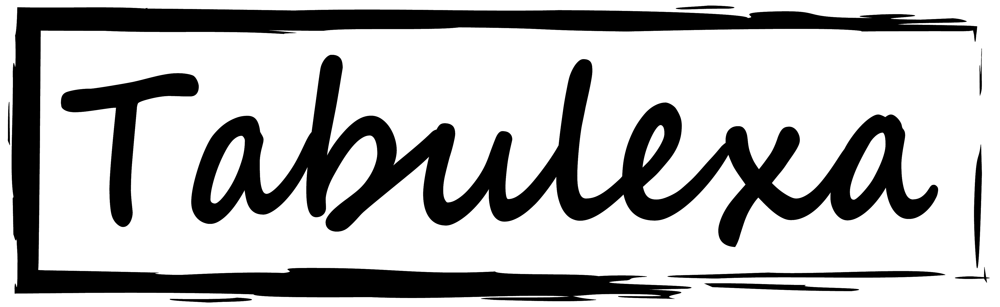
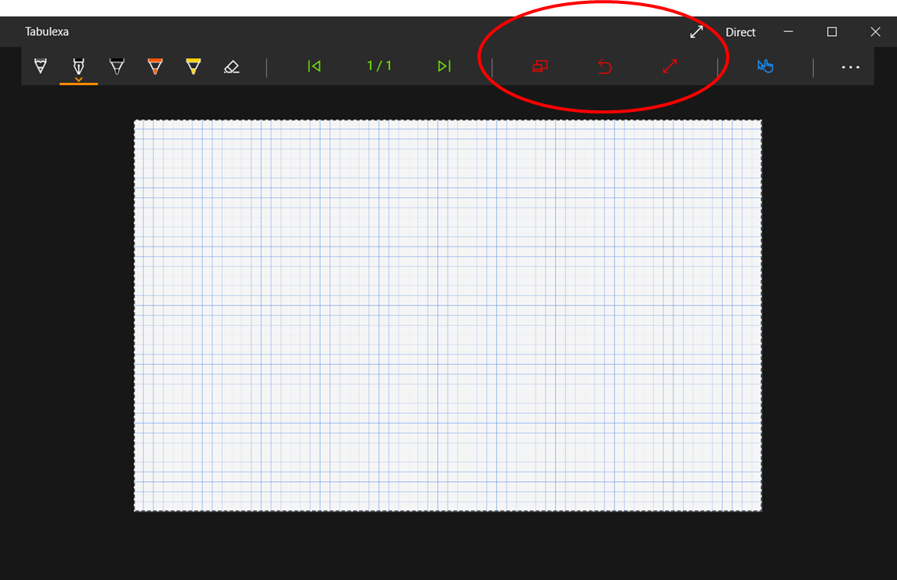

Tabulexa is a digital handwriting app for presentations and teaching. The app provides a simple interface for handwritten notes. You can either project your notes while writing to a second screen, projector, and television, or you can pre-record your handwriting and replay it during your presentation. Similar to powerpoint slides, you can group your notes on apage into blocks and display them sequentially.    

You can download the app from Microsoft's App Store: [https://www.microsoft.com/store/apps/9MXZC8VJJ5W4](https://www.microsoft.com/store/apps/9MXZC8VJJ5W4) or install the msix package from Github.

## Requirements:

- Windows 10 (version 1903 or later)
- Touch or pen sensitive display + Digital pen

It helps to write on a device that is flat on a table, e.g. a 360-degree laptop, a pen display, or a device of the Microsoft Surface Family.

## Motivation:

Handwritten lectures have always been popular in sciences and show a recent revival in other fields. Writing on a blackboard decelerates the lecturer and provides enough time for the listeners to digest the content. The students need to focus when copying the lecture notes and it forces them to follow a derivation step by step. Just watch students during a typical “death-by-powerpoint” presentation and compare it to the focused concentration during a maths lecture.

However, blackboards and whiteboards are no longer timely and they are often removed from lecture rooms. Covid-19, with a demand for online teaching, accelerates this process even more. This app provides a simple interface to write and project your handwritten notes with the following two design goals.

### (1) Decouple the presentation interface from the projection window for the audience.

The main reason to decouple both windows is not the listener’s distraction due to control-buttons and flyout-menus, but it is the need to zoom in and out while writing with a digital pen. Most people seem to have a larger handwriting on a graphics tablet than on a sheet of paper. To avoid filling the complete board with just a few lines of text, it is necessary to increase the zoom factor while writing. The audience, however, should only see the complete window without changing sizes.

### (2) Mix live handwriting with pre-recorded notes.

There are incredible educational videos with handwriting on youtube, e.g. the Khan Academy. The presentation style and the pedagogic concepts in those videos are fantastic. Unfortunately, today’s students start to expect a similar presentation quality during a lecture. Pre-recording your lectures slides can improve the artistic style and readability. In addition, it is a waste of time to prepare the layout of the text before the presentation, erase it, and reproduce it with the students. It is much easier to pre-record the handwritten text and to replay sections of it during the lecture - whenever it is needed.

## Control modes

The app has three control modes that can be selected on the first page.
- The DIRECT mode provides the normal live-lecture experience. The projection windows displays directly what you write on the tablet or laptop.
- The EDIT mode is intended for the preparation process. It allows you to write the text for a lecture and to group your notes in replay blocks. You can split, join, and re-order the text blocks.
- The REPLAY mode is intended for a live-lecture with replay elements. You can write text in the same way as in the direct mode. Pre-recorded blocks are greyed out and not visible to the students untily activate the replay when needed.

## Projection window

Only the projection window is observable by the audience. It will always open on the next display in your Windows 10 display list, i.e. the display that follows after the display of the main app window. Typically, this is on a projector or a second monitor, but it can also be on a television or another miracast device. Repeatedly pressing of the “Flip screen” button cycles the projection window through the display list. 

## Side ratio of the projection window

It is helpful to chose already during the preparation of the lecture a side ratio that is close to the ratio of the projector. Each page has a permanent side ratio, but opening a projection window changes the displayed side ratio in the main window to match the ratio of the projection window. The permanent side ratio of the document reappears once the projection window is closed.

### Contact

Having trouble with Pages? Check out our [documentation](https://docs.github.com/categories/github-pages-basics/) or [contact support](https://support.github.com/contact) and we’ll help you sort it out.
